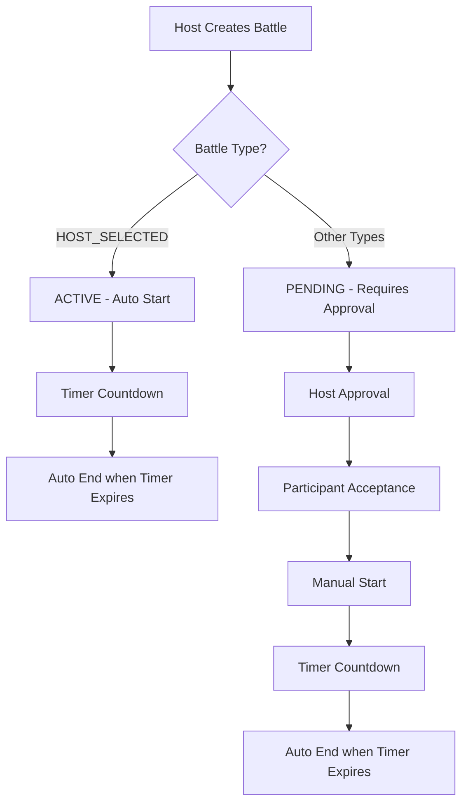

# PK Battle Auto-Start System (HOST_SELECTED)

## Overview

The PK Battle system has been enhanced to support automatic battle initiation for `HOST_SELECTED` type battles. When a host creates a battle with this type, it immediately starts without requiring participant approval and runs for the allocated time.

## Key Changes

### 1. Battle Type Workflow Differences

#### HOST_SELECTED Battles (NEW Auto-Start Behavior):

1. **Creation** → **ACTIVE** (Immediate)
2. No approval required from participants
3. Automatic start with timer countdown
4. Auto-end when time expires
5. Host can participate as a contestant

#### Other Battle Types (Traditional Workflow):

1. **Creation** → **PENDING**
2. **Approval** → **APPROVED**
3. **Participant Acceptance** → **ACTIVE**
4. Manual start by host required

### 2. Updated Battle Status Flow



### 3. Service Layer Changes

#### Enhanced `createPKBattle` Method:

```typescript
// Create the battle with conditional status
const now = new Date()
const battle = this.pkBattleRepository.create({
    roomId,
    hostId,
    battleType,
    duration: durationMinutes * 60,
    // HOST_SELECTED starts immediately as ACTIVE
    status:
        battleType === PKBattleType.HOST_SELECTED
            ? PKBattleStatus.ACTIVE
            : PKBattleStatus.PENDING,
    description,
    metadata,
    // Set start/end times for HOST_SELECTED battles
    startTime: battleType === PKBattleType.HOST_SELECTED ? now : undefined,
    endTime:
        battleType === PKBattleType.HOST_SELECTED
            ? new Date(now.getTime() + durationMinutes * 60 * 1000)
            : undefined
})

// Participants are automatically active for HOST_SELECTED
status: battleType === PKBattleType.HOST_SELECTED
    ? PKBattleParticipantStatus.ACTIVE
    : PKBattleParticipantStatus.INVITED

// Auto-schedule battle end for HOST_SELECTED
if (battleType === PKBattleType.HOST_SELECTED) {
    setTimeout(
        async () => {
            await this.endPKBattle(savedBattle.uuid)
        },
        durationMinutes * 60 * 1000
    )
}
```

#### Updated `startPKBattle` Method:

```typescript
// HOST_SELECTED battles cannot be manually started
if (battle.battleType === PKBattleType.HOST_SELECTED) {
    if (battle.status === PKBattleStatus.ACTIVE) {
        return battle // Already active
    } else {
        throw new BadRequestException(
            'HOST_SELECTED battles start automatically and cannot be manually started'
        )
    }
}
```

#### Updated `respondToPKBattle` Method:

```typescript
// HOST_SELECTED battles don't require responses
if (participant.battle.battleType === PKBattleType.HOST_SELECTED) {
    throw new BadRequestException(
        'HOST_SELECTED battles do not require participant approval - they start automatically'
    )
}
```

### 4. WebSocket Events Enhanced

#### Battle Creation Event:

```javascript
// Enhanced pkBattleCreated event
socket.emit('pkBattleCreated', {
    battleId: battle.uuid,
    roomId: data.roomId,
    hostId: userId,
    status: battle.status, // 'active' for HOST_SELECTED
    battleType: battle.battleType,
    startTime: battle.startTime, // Immediate for HOST_SELECTED
    endTime: battle.endTime, // End time calculated
    participants: [
        {
            userId: 'participant1',
            status: 'active', // Immediately active for HOST_SELECTED
            joinedAt: now // Immediate join time
        }
    ],
    isAutoStarted: true // Flag for HOST_SELECTED battles
})

// Additional event for auto-started battles
socket.emit('pkBattleStarted', {
    battleId: battle.uuid,
    roomId: data.roomId,
    status: 'active',
    startTime: battle.startTime,
    endTime: battle.endTime,
    message: 'PK Battle started automatically (Host Selected)'
})
```

### 5. Battle Lifecycle Comparison

#### Traditional Battle Flow:

```
1. Host creates battle → PENDING
2. Host approves battle → APPROVED
3. Participants accept → Ready
4. Host manually starts → ACTIVE
5. Timer runs → Auto-end → COMPLETED
```

#### HOST_SELECTED Battle Flow:

```
1. Host creates battle → ACTIVE (immediate)
2. Timer starts immediately
3. Participants are auto-active
4. Timer runs → Auto-end → COMPLETED
```

### 6. API Usage Examples

#### Creating Auto-Start Battle:

```javascript
// WebSocket: Create HOST_SELECTED battle
socket.emit('createPKBattle', {
    roomId: 'room-123',
    participantIds: ['host-id', 'participant-id'],
    durationMinutes: 5,
    battleType: 'host_selected', // Key: Auto-start type
    description: 'Quick challenge battle'
})

// Response: Battle immediately active
socket.on('pkBattleCreated', (data) => {
    console.log('Battle Status:', data.status) // 'active'
    console.log('Auto Started:', data.isAutoStarted) // true
    console.log('End Time:', data.endTime) // 5 minutes from now
})

// Additional start event for UI updates
socket.on('pkBattleStarted', (data) => {
    console.log('Battle auto-started!')
    // Update UI to show active battle immediately
})
```

#### Attempting to Start HOST_SELECTED Battle:

```javascript
// This will fail for HOST_SELECTED battles
socket.emit('startPKBattle', {
    battleId: 'battle-456'
})

// Response: Error message
socket.on('startPKBattleResponse', (data) => {
    console.log(data.status) // 'error'
    console.log(data.message) // 'HOST_SELECTED battles start automatically...'
})
```

#### Attempting to Respond to HOST_SELECTED Battle:

```javascript
// This will fail for HOST_SELECTED battles
socket.emit('respondToPKBattle', {
    battleId: 'battle-456',
    accepted: true
})

// Response: Error message
socket.on('respondToPKBattleResponse', (data) => {
    console.log(data.status) // 'error'
    console.log(data.message) // 'HOST_SELECTED battles do not require participant approval...'
})
```

### 7. Frontend Integration Guidelines

#### Battle Creation UI:

```javascript
// When creating HOST_SELECTED battle
function createHostSelectedBattle(roomId, participantIds, duration) {
    // Show immediate start warning
    showMessage('Battle will start immediately!')

    socket.emit('createPKBattle', {
        roomId,
        participantIds,
        durationMinutes: duration,
        battleType: 'host_selected'
    })
}

// Handle creation response
socket.on('pkBattleCreated', (data) => {
    if (data.isAutoStarted) {
        // Immediately show active battle UI
        showActiveBattleInterface(data)
        startBattleTimer(data.endTime)
    } else {
        // Show pending battle UI
        showPendingBattleInterface(data)
    }
})
```

#### Battle State Management:

```javascript
// Handle different battle states
socket.on('pkBattleCreated', (battle) => {
    switch (battle.status) {
        case 'active':
            // HOST_SELECTED - immediately active
            startBattleInterface(battle)
            break
        case 'pending':
            // Traditional - awaiting approval
            showPendingInterface(battle)
            break
    }
})

socket.on('pkBattleStarted', (battle) => {
    // Additional start event (for HOST_SELECTED auto-start)
    if (battle.message.includes('automatically')) {
        showAutoStartNotification()
    }
    startBattleInterface(battle)
})
```

### 8. Timer Management

#### Auto-End Implementation:

```typescript
// Service automatically schedules battle end
if (battleType === PKBattleType.HOST_SELECTED) {
    setTimeout(
        async () => {
            try {
                await this.endPKBattle(savedBattle.uuid)
            } catch (error) {
                this.logger.error(
                    `Failed to auto-end PK battle: ${error.message}`
                )
            }
        },
        durationMinutes * 60 * 1000
    )
}
```

#### Frontend Timer Display:

```javascript
// Calculate remaining time for active battles
function calculateRemainingTime(endTime) {
    const now = new Date()
    const end = new Date(endTime)
    const remaining = Math.max(0, end.getTime() - now.getTime())
    return Math.floor(remaining / 1000) // seconds
}

// Update timer display
function updateBattleTimer(battleId, endTime) {
    const interval = setInterval(() => {
        const remaining = calculateRemainingTime(endTime)
        if (remaining <= 0) {
            clearInterval(interval)
            handleBattleEnd(battleId)
        } else {
            displayTimer(remaining)
        }
    }, 1000)
}
```

### 9. Benefits of Auto-Start System

#### For Hosts:

- **Immediate Action**: No waiting for approvals
- **Full Control**: Host decides participants and starts immediately
- **Streamlined Flow**: Single action creates and starts battle
- **Time Efficiency**: No multi-step approval process

#### For Participants:

- **Instant Engagement**: Jump straight into battle
- **No Approval Friction**: No need to accept/decline invitations
- **Clear Expectations**: Know battle duration upfront
- **Focus on Competition**: Less UI complexity, more gaming

#### For Room Dynamics:

- **Quick Entertainment**: Instant battles for engagement
- **Host Authority**: Clear host control over room activities
- **Spectator Excitement**: Immediate action for observers
- **Time Management**: Fixed duration battles

### 10. Migration and Compatibility

#### Backward Compatibility:

- ✅ Existing battle types work unchanged
- ✅ Traditional approval flow preserved for non-HOST_SELECTED
- ✅ All existing WebSocket events supported
- ✅ Client can detect auto-start via `isAutoStarted` flag

#### Frontend Updates Required:

1. **Handle immediate active status** in battle creation response
2. **Skip approval UI** for HOST_SELECTED battles
3. **Show timer immediately** when battle is auto-started
4. **Update battle state management** to handle instant activation

### 11. Error Handling

#### Common Scenarios:

```javascript
// HOST_SELECTED battle creation - success
{
    status: 'success',
    battleId: 'battle-123',
    message: 'PK Battle created and started automatically'
}

// Trying to manually start HOST_SELECTED battle - error
{
    status: 'error',
    message: 'HOST_SELECTED battles start automatically and cannot be manually started'
}

// Trying to respond to HOST_SELECTED battle - error
{
    status: 'error',
    message: 'HOST_SELECTED battles do not require participant approval - they start automatically'
}
```

## Implementation Status

### ✅ Completed:

1. **Service Layer**: Auto-start logic for HOST_SELECTED battles
2. **Entity Updates**: Enhanced status and timing fields
3. **WebSocket Events**: Added auto-start detection and events
4. **Timer Management**: Automatic scheduling and cleanup
5. **Error Handling**: Proper validation for auto-start battles
6. **Host Participation**: Hosts can compete in their own battles

### 🔄 Client Integration Required:

1. **UI Updates**: Handle immediate active state
2. **Timer Display**: Show countdown from creation
3. **State Management**: Skip approval flows for HOST_SELECTED
4. **Notifications**: Show auto-start messages

This enhanced system provides a much more streamlined and engaging PK Battle experience for host-selected competitions while maintaining full compatibility with traditional battle flows.
